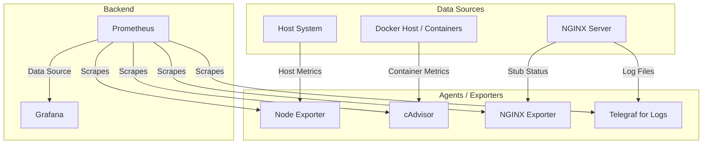
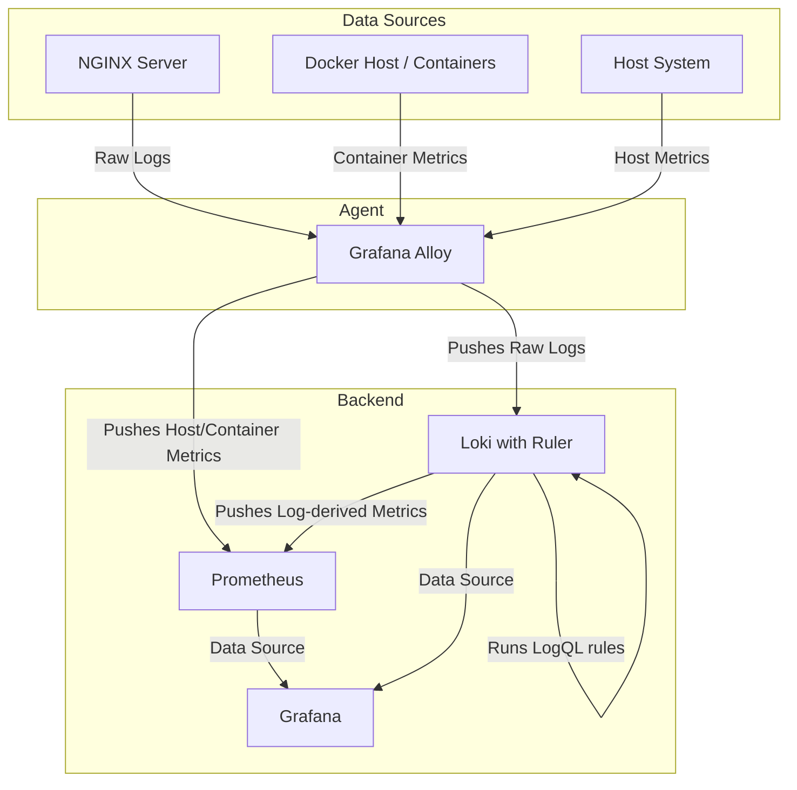

# Monitoring Architecture Evolution

This document outlines the final, successful monitoring architecture.

---

## 1. Old Architecture (for reference)

The previous setup used a combination of specialized, single-purpose exporters and agents. Each agent exposed metrics on a specific port, and Prometheus was configured to actively scrape all of them.

### Old Data Flow:

### Old Component Roles:

-   **`Node Exporter`**: Exposed host system metrics (CPU, RAM, Disk).
-   **`cAdvisor`**: Exposed container metrics.
-   **`NGINX Prometheus Exporter`**: Scraped the NGINX stub status page to expose NGINX connection metrics.
-   **`Telegraf`**: Tailed NGINX log files and converted them into metrics consumable by Prometheus.
-   **`Prometheus`**: Was configured with a complex scrape configuration to pull metrics from all four exporters listed above.
-   **`Grafana`**: Queried Prometheus for all metrics.

---

## 2. New "Loki Ruler" Architecture (Final)

The new setup uses Grafana Alloy as a primary agent for metrics and log shipping, and a powerful Loki instance with a built-in Ruler for processing logs into metrics.

### Data Flow:

### Component Roles:

-   **`Grafana Alloy`**: Acts as a multi-purpose agent.
    -   Collects host system metrics (CPU, RAM, Disk, Network).
    -   Collects all container metrics.
    -   Tails Nginx log files (`access.log`, `error.log`) and forwards them to Loki.
    -   Pushes all collected metrics (host, container) directly to Prometheus.

-   **`Loki`**: Acts as a log storage and processing backend.
    -   Receives raw logs from Alloy.
    -   The **Loki Ruler** runs recording rules (using LogQL like `count_over_time`) on the log streams to pre-calculate new metrics (e.g., `nginx:requests:increase_5m`).
    -   Pushes these new, pre-calculated metrics to Prometheus via `remote_write`.

-   **`Prometheus`**: Acts as the central time-series database.
    -   Receives metrics from two sources: Alloy (for host/container) and Loki (for log-derived Nginx metrics).

-   **`Grafana`**: The single pane of glass for visualization.
    -   Queries **Prometheus** for all metrics (host, container, and Nginx).
    -   Queries **Loki** to display raw logs.
