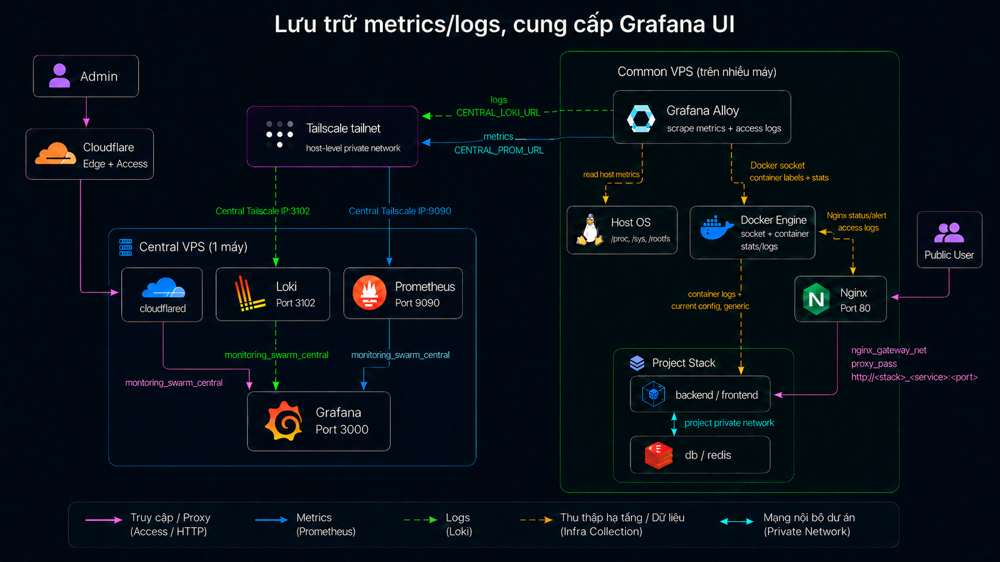

# Centralized Monitoring Architecture

Tài liệu này mô tả kiến trúc của repo, dựa trên các file compose và config thực tế. Mục tiêu: đọc xong hiểu **vai trò từng thành phần và vì sao chúng được kết nối như vậy**.

Nếu bạn muốn:

- Setup + vận hành trên Central VPS → [`central-vps.md`](central-vps.md)
- Setup + thêm app mới + migrate trên Common VPS → [`common-vps.md`](common-vps.md)
- Vận hành định kỳ ("đổi config X thì chạy lệnh gì") → [`README.md`](../README.md)
- Tailscale policy đầy đủ → [`tailscale-policy.md`](tailscale-policy.md)
- Cloudflare Tunnel production cho Grafana → [`cloudflare-tunnel-grafana-production.md`](cloudflare-tunnel-grafana-production.md)

## Tổng Quan

Repo dùng mô hình nhiều VPS:

| Nhóm | Vai trò |
|---|---|
| Common VPS | Chạy app, Nginx ingress, Alloy agent |
| Central VPS | Nhận/lưu metrics + logs, hiển thị Grafana |



Mermaid source để cập nhật ảnh nằm ở [`architecture-source.mmd`](architecture-source.mmd).

Luồng chính:

```text
Public user -> Common Nginx :80 -> app service qua nginx_gateway_net
Common Alloy -> host metrics + container metrics + Docker logs
             -> Central Prometheus + Loki qua Tailscale
Admin -> Cloudflare Tunnel + Access -> Central Grafana
```

Điểm cốt lõi:

- App public **không** publish port host. Nginx là ingress public duy nhất.
- Nginx route app bằng tên service Swarm: `http://<stack>_<service>:<port>`.
- Alloy không join network của app. Nó đọc dữ liệu qua Docker socket và host mounts.
- Tailscale **không** phải Docker network; nó là đường private giữa host VPS với nhau.
- Grafana **không** publish port `3000`; admin truy cập qua Cloudflare Tunnel.

## Mục Lục

1. [Common VPS](#1-common-vps)
2. [Central VPS](#2-central-vps)
3. [Network](#3-network)
4. [Tailscale](#4-tailscale)
5. [Cloudflare Tunnel](#5-cloudflare-tunnel)
6. [Dữ liệu Alloy thu thập](#6-dữ-liệu-alloy-thu-thập)
7. [Dashboard](#7-dashboard)
8. [Security](#8-security)
9. [Điểm dễ nhầm](#9-điểm-dễ-nhầm)

## 1. Common VPS

Common VPS chạy stack `monitoring_common` từ [`docker-compose.common.yml`](../docker-compose.common.yml):

```text
monitoring_common
├── nginx
└── alloy
```

### 1.1. Nginx

Nginx là public ingress cho app trên Common VPS.

Config:

- [`common/nginx/nginx.conf`](../common/nginx/nginx.conf) — base config và log format
- `common/nginx/nginx_sites_available` — vhost mount từ file bạn copy/sửa (mẫu ở [`nginx_sites_available.example`](../common/nginx/nginx_sites_available.example))

Compose:

```yaml
ports:
  - "80:80"
networks:
  - monitoring_swarm_common
  - nginx_gateway_net
```

Nginx join 2 network vì 2 mục đích khác nhau:

| Network | Vì sao Nginx join |
|---|---|
| `monitoring_swarm_common` | Network nội bộ stack `monitoring_common` (Nginx + Alloy cùng stack). Không dùng để route app public. |
| `nginx_gateway_net` | Network ingress chung. Nginx cần network này để gọi service app public bằng `http://<stack>_<service>:<port>`. |

Khi thêm app mới, service app public cũng phải join `nginx_gateway_net`. DB, Redis, worker **không** join network này. Chi tiết: xem [`common-vps.md`](common-vps.md).

Vì sao không dùng `proxy_pass http://172.17.0.1:<port>`:

- App phải publish port host → dễ bị truy cập trực tiếp từ Internet.
- Conflict port khi có nhiều project.
- Khó biết port đó thuộc service nào.

#### Log format có `$project`

Log format trong [`nginx.conf`](../common/nginx/nginx.conf) thêm 3 trường cuối:

```nginx
log_format main_with_time '$real_client_ip - $remote_user [$time_local] "$request" '
                          '$status $body_bytes_sent "$http_referer" '
                          '"$http_user_agent" "$project" "$host" "$request_time"';
```

Alloy parse 3 trường này để gắn label `project`, `host`, và sinh metric latency từ `$request_time`. Vì vậy mỗi `server {}` phải:

```nginx
set $project "<TEN_STACK_SWARM>";
```

Nếu thiếu hoặc lệch, dashboard vẫn nhận dữ liệu nhưng label `project` rơi vào `unknown`.

### 1.2. Alloy

Alloy là agent thu thập metrics/logs trên Common VPS.

Config:

- [`common/alloy/config.alloy`](../common/alloy/config.alloy) — pipeline metrics + logs (dùng chung cho cả Common và Central, khác biệt nằm ở env var)
- `.env` cung cấp `VPS_NAME`, `CENTRAL_PROM_URL`, `CENTRAL_LOKI_URL`

Compose:

```yaml
networks:
  - monitoring_swarm_common
volumes:
  - /proc:/host/proc:ro
  - /sys:/host/sys:ro
  - /:/host/root:ro
  - /var/run/docker.sock:/var/run/docker.sock:ro
  - /var/lib/docker/containers:/var/lib/docker/containers:ro
```

Alloy chỉ join `monitoring_swarm_common`. Nó **không** join `nginx_gateway_net` và **không** join project private network.

Lý do: Alloy không cần gọi app qua network. Nó quan sát host và Docker qua:

- `/proc`, `/sys`, rootfs để lấy host metrics.
- Docker socket để discover container và lấy labels/stats.
- `/var/lib/docker/containers` để đọc log files.

## 2. Central VPS

Central VPS chạy stack `monitoring_central` từ [`docker-compose.central.yml`](../docker-compose.central.yml):

```text
monitoring_central
├── prometheus
├── loki
├── grafana
├── alloy
└── cloudflared
```

Tất cả service join network `monitoring_swarm_central`.

### 2.1. Prometheus

Prometheus nhận metrics từ Alloy qua **remote write**, không scrape gì cả.

Compose:

```yaml
ports:
  - "9090:9090"
command:
  - "--web.enable-remote-write-receiver"
  - "--storage.tsdb.retention.time=5d"
  - "--storage.tsdb.retention.size=10GB"
```

File [`central/prometheus/prometheus.yml`](../central/prometheus/prometheus.yml) chỉ có `global:` (scrape_interval/evaluation_interval). Không có `scrape_configs`, không có target nào. Toàn bộ metrics đến từ Alloy push, kể cả Alloy self-metrics.

Đường gửi metrics:

- Common Alloy → `http://<CENTRAL_TAILSCALE_IP>:9090/api/v1/write`
- Central Alloy → `http://prometheus:9090/api/v1/write` (DNS nội bộ)
- Loki ruler → `http://prometheus:9090/api/v1/write` (DNS nội bộ, cho recording rules)

Port `9090` chỉ cần truy cập được từ Common qua Tailscale, **không** public Internet.

### 2.2. Loki

Loki nhận logs từ Alloy.

Compose:

```yaml
ports:
  - "3102:3102"
```

Config [`central/loki/config.yaml`](../central/loki/config.yaml):

- `target: all` — chạy single binary mode (gộp ingester/querier/ruler vào 1 process)
- `auth_enabled: false` — không yêu cầu tenant header → tenant default là `fake`
- Lưu data bằng filesystem volume `loki_data`
- Retention `72h`
- Ruler đọc static rules từ `central/loki/rules_source`
- Ruler remote_write metrics về Prometheus nội bộ

Đường gửi logs:

- Common Alloy → `http://<CENTRAL_TAILSCALE_IP>:3102/loki/api/v1/push`
- Central Alloy → `http://loki:3102/loki/api/v1/push`

#### Loki ruler tạo metric từ logs

File [`central/loki/rules_source/fake/metrics.yml`](../central/loki/rules_source/fake/metrics.yml). Thư mục `fake/` không phải placeholder; đây là tenant ID mặc định mà Loki gán khi `auth_enabled: false`. Loki ruler yêu cầu rules nằm trong thư mục theo tenant.

Các rule query log stream `{job="nginx"}` bằng LogQL, gom theo `project`, `vps`, `resp_code`, `request`, `country_name`, rồi ghi thành Prometheus metrics:

| Recording metric | Nguồn LogQL | Dùng để |
|---|---|---|
| `loki_nginx_requests_rate` | `rate({job="nginx"}[5m])` | Request rate |
| `loki_nginx_requests_total_1m` | `count_over_time({job="nginx"}[1m])` | Top API theo 1 phút |
| `loki_nginx_requests_total_15s` | `count_over_time({job="nginx"}[15s])` | Tổng request, error rate |
| `loki_nginx_requests_total_by_country` | `count_over_time(...)` group theo country | Bản đồ traffic |

Luồng đầy đủ:

```text
Nginx access log -> Alloy parse -> Loki stream {job="nginx"}
                                -> Loki ruler chạy LogQL recording rules
                                -> Loki remote_write metrics sang Prometheus
                                -> Grafana query metrics loki_nginx_*
```

### 2.3. Grafana

Grafana là UI để xem dashboard.

Compose:

- **Không** publish `3000` ra host.
- Join `monitoring_swarm_central`.
- Public qua `cloudflared`, không qua Nginx.

Provisioning:

- Datasource [`central/grafana/provisioning/datasources/datasources.yml`](../central/grafana/provisioning/datasources/datasources.yml):
  - `Prometheus` → `http://prometheus:9090`
  - `Loki` → `http://loki:3102`
- Dashboard [`central/grafana/provisioning/dashboards/dashboards.yml`](../central/grafana/provisioning/dashboards/dashboards.yml) trỏ vào folder `central/dashboards/projects` với `foldersFromFilesStructure: true` → mỗi project thành 1 folder trong Grafana.

### 2.4. Central Alloy

Central cũng chạy Alloy để collect metrics/logs của chính Central VPS (CPU/RAM/disk của Prometheus, Loki, Grafana, ...).

Nó dùng chung file [`common/alloy/config.alloy`](../common/alloy/config.alloy), nhưng [`docker-compose.central.yml`](../docker-compose.central.yml) override 2 endpoint:

```yaml
- CENTRAL_PROM_URL=http://prometheus:9090/api/v1/write
- CENTRAL_LOKI_URL=http://loki:3102/loki/api/v1/push
```

Vì Central Alloy ở cùng network `monitoring_swarm_central` với Prometheus/Loki, nó gọi bằng DNS nội bộ, không qua Tailscale.

**Đừng sửa `CENTRAL_PROM_URL`/`CENTRAL_LOKI_URL` ở `.env` của Central**: compose đã override nên giá trị trong `.env` bị bỏ qua.

### 2.5. cloudflared

`cloudflared` đưa Grafana ra Internet qua Cloudflare Tunnel.

Compose:

- Image `cloudflare/cloudflared:2026.3.0`
- Dùng Docker secret `cf_tunnel_token` (external, tạo bằng `docker secret create`)
- Join `monitoring_swarm_central`
- **Không** publish port host

Cloudflare Tunnel route vào Grafana bằng URL nội bộ:

```text
http://grafana:3000
```

Chi tiết setup, Cloudflare Access, rotate token: xem [`cloudflare-tunnel-grafana-production.md`](cloudflare-tunnel-grafana-production.md).

## 3. Network

### 3.1. Bảng network

| Network / đường kết nối | Ai dùng | Mục đích | Không dùng cho |
|---|---|---|---|
| `monitoring_swarm_common` | `monitoring_common_nginx`, `monitoring_common_alloy` | Network nội bộ stack Common | Route app public |
| `nginx_gateway_net` | Common Nginx + service app public | Nginx gọi app bằng `http://<stack>_<service>:<port>` | DB, Redis, worker, Alloy |
| Project private network | App + DB + Redis + worker của project | Giao tiếp nội bộ project | Public ingress |
| `monitoring_swarm_central` | Prometheus, Loki, Grafana, Alloy, cloudflared | Giao tiếp nội bộ Central stack | Common VPS gọi bằng Docker DNS |
| Tailscale tailnet | Common host → Central host | Common Alloy đẩy metrics/logs về Central | Nginx gọi app |
| Cloudflare Tunnel | Admin → Cloudflare → cloudflared → Grafana | Public Grafana an toàn hơn publish `3000` | Prometheus/Loki ingest |

### 3.2. `nginx_gateway_net`

`nginx_gateway_net` là external overlay network:

```yaml
networks:
  nginx_gateway_net:
    external: true
    name: nginx_gateway_net
```

Tạo trước khi deploy:

```bash
make gateway_network
```

Join network này: Common Nginx + service app nào cần nhận public traffic.

**Không** join network này: Database, Redis, Worker, service internal, Alloy.

### 3.3. Tailscale + Cloudflare Tunnel không phải Docker network

Docker overlay network chỉ giải quyết giao tiếp container-to-container trong cùng Swarm. Hai đường dưới đây ở tầng host hoặc Internet:

- **Tailscale** — đường private host-to-host. Xem [§4](#4-tailscale) và [`tailscale-policy.md`](tailscale-policy.md).
- **Cloudflare Tunnel** — đường public admin vào Grafana qua Cloudflare Edge. Xem [§5](#5-cloudflare-tunnel) và [`cloudflare-tunnel-grafana-production.md`](cloudflare-tunnel-grafana-production.md).

## 4. Tailscale

Tailscale là đường private giữa các host VPS, dùng để Common Alloy gửi metrics/logs về Central mà không cần public port `9090`/`3102` ra Internet.

Luồng thực tế:

```text
Common Alloy container
  -> Docker network egress trên Common host
  -> Tailscale interface của Common host
  -> Tailscale interface của Central host
  -> published port 9090/3102 trên Central host
  -> Prometheus/Loki container
```

Trên Common VPS, `.env`:

```env
CENTRAL_PROM_URL=http://<CENTRAL_TAILSCALE_IP>:9090/api/v1/write
CENTRAL_LOKI_URL=http://<CENTRAL_TAILSCALE_IP>:3102/loki/api/v1/push
```

Trên Central, Prometheus và Loki publish ra host (xem `docker-compose.central.yml`):

```yaml
prometheus:
  ports:
    - "9090:9090"
loki:
  ports:
    - "3102:3102"
```

Vì port được publish ra host, Common có thể gọi `CENTRAL_TAILSCALE_IP:9090` và `:3102`.

Chi tiết cài Tailscale, dùng tag, viết policy ACL, mẫu policy JSON: xem [`tailscale-policy.md`](tailscale-policy.md).

### Điểm dễ nhầm về Tailscale

- Tailscale **không** thay thế `nginx_gateway_net`.
- Tailscale **không** dùng để Nginx gọi app.
- Tailscale **không** làm Common nhìn thấy Docker DNS `prometheus` / `loki` của Central.
- Tailscale chỉ tạo đường host-to-host; Docker container vẫn đi ra ngoài qua network stack của host.

## 5. Cloudflare Tunnel

Cloudflare Tunnel là đường admin truy cập Grafana từ Internet mà **không** cần publish Grafana `3000` ra host.

Luồng:

```text
Admin browser
  -> Cloudflare Edge + Access (xác thực)
  -> Cloudflare Tunnel
  -> cloudflared service trên Central (outbound-only)
  -> http://grafana:3000 qua monitoring_swarm_central
```

`cloudflared` tạo kết nối **outbound** từ Central tới Cloudflare. Vì vậy Grafana không cần mở inbound port public.

Token tunnel được cấp bằng Docker secret `cf_tunnel_token`, không nằm trong repo hay `.env`.

Chi tiết tạo tunnel remote-managed, bật Cloudflare Access, rotate token, production checklist: xem [`cloudflare-tunnel-grafana-production.md`](cloudflare-tunnel-grafana-production.md).

### Điểm dễ nhầm về Cloudflare Tunnel

- Cloudflare Tunnel **không** dùng để Alloy gửi metrics/logs.
- Cloudflare Tunnel **không** thay thế Tailscale.
- `cloudflared` không phải Grafana; nó chỉ chuyển request từ Cloudflare vào service nội bộ. Nếu `cloudflared` chết, Grafana container vẫn có thể đang chạy nhưng admin không vào được qua domain public.
- Cloudflare **Tunnel** và Cloudflare **Access** là 2 thứ khác nhau: Tunnel lo đường mạng, Access lo xác thực. Nếu không bật Access, domain Grafana có thể public cho cả Internet.

## 6. Dữ Liệu Alloy Thu Thập

### 6.1. Metrics

| Loại metric | Nguồn | Cấu hình Alloy |
|---|---|---|
| Host CPU/RAM/disk/network | `/host/proc`, `/host/sys`, `/host/root` | `prometheus.exporter.unix "system"` |
| Container CPU/RAM/network/filesystem | Docker socket + cgroup mounts | `prometheus.exporter.cadvisor "containers"` |
| Alloy self-metrics | Alloy process | `prometheus.exporter.self "alloy"` |

Mọi metric được gắn label:

- `vps` — từ `VPS_NAME` hoặc hostname
- `instance` — từ `VPS_NAME` hoặc hostname

Container metrics chuẩn hóa thêm các label sau (lấy từ Docker labels của container):

- `container` — tên container đã bỏ dấu `/` đầu
- `service` — Swarm service name (ưu tiên) hoặc Compose service name
- `stack` — Compose project hoặc Swarm stack namespace
- `project` — unified label, ưu tiên Swarm stack namespace
- `image` — image name

Để tránh high cardinality, Alloy `labeldrop` các label gốc như `id`, `name`, `container_label_*`. Một số metric ít dùng cũng bị drop (`container_tasks_state`, `container_memory_failures_total`, `container_blkio_*`, ...).

Phần trăm CPU/RAM trên dashboard **không** phải giá trị Alloy đọc sẵn — dashboard tính bằng PromQL từ metric thô (vd `rate(container_cpu_usage_seconds_total[...])`).

### 6.2. Logs

Alloy đọc Docker logs qua Docker socket và `/var/lib/docker/containers`. Mọi container đều được đẩy logs về Loki, không chỉ Nginx.

Pipeline `loki.process "docker_logs"` thêm `level` label bằng regex match (`error|warn|info|debug|...`) trên log line.

Riêng Nginx access log được parse sâu hơn khi container có `compose_service` match regex `(.*_)?nginx`. Parse ra các label:

- `verb` — HTTP method
- `request` — request path (có thể normalize tuỳ env `NORMALIZE_NGINX_PATH`)
- `resp_code` — gom thành `2xx`/`3xx`/`4xx`/`5xx`/`other`
- `country_name` — từ GeoIP của client IP (mmdb tại `/etc/alloy/geoip/GeoLite2-City.mmdb`)
- `project` — từ field `$project` trong log; fallback `host`, fallback `unknown`
- `host` — Host header

Có 2 chế độ cho `request`:

- `NORMALIZE_NGINX_PATH=false` (mặc định) — giữ path gốc, chỉ chuẩn hóa UUID/hash/long-slug.
- `NORMALIZE_NGINX_PATH=true` — chuẩn hóa thêm numeric ID (`/123/` → `/:id/`) và named slug.

Pipeline log set `job="nginx"` cho dòng đã parse được.

### 6.3. Metrics sinh từ logs

Pipeline `loki.process "nginx_metrics"` (riêng với pipeline log) tạo histogram latency từ `$request_time`:

```text
loki_process_custom_nginxlog_request_duration_seconds_bucket
loki_process_custom_nginxlog_request_duration_seconds_count
loki_process_custom_nginxlog_request_duration_seconds_sum
```

Base name trong config là `nginxlog_request_duration_seconds`; prefix `loki_process_custom_` được thêm khi metric vào Prometheus. Buckets: `[0.1, 0.5, 1, 5]` (gọn để tránh high cardinality). Pipeline metrics luôn normalize request path để giảm cardinality.

Ngoài histogram này, Loki **ruler** trên Central tạo thêm 4 metric `loki_nginx_*` từ LogQL recording rules. Xem [§2.2](#22-loki).

## 7. Dashboard

### 7.1. Templates

3 dashboard template trong [`central/dashboards/projects/_all/`](../central/dashboards/projects/_all):

| File | Nguồn dữ liệu | Dùng để |
|---|---|---|
| `system_monitoring.json` | Host + container metrics (Alloy/cAdvisor) | CPU/RAM/disk/network host và container |
| `container_logs_dashboard.json` | Docker logs trong Loki | Xem logs theo VPS, project, service, level |
| `nginx_api_observability.json` | `loki_nginx_*` + `loki_process_custom_nginxlog_*` | Request rate, 2xx/4xx/5xx, latency P95/P99, top API, country |

### 7.2. Vì sao dashboard lọc được theo project

Tất cả nhờ label `project`:

- **Container metrics**: Alloy gán `project` từ Docker label `com.docker.stack.namespace` (Swarm) hoặc `com.docker.compose.project` (Compose). Với app deploy bằng `docker stack deploy ... qr_code`, label sẽ là `project="qr_code"`.
- **Nginx API**: Alloy gán `project` từ field `$project` trong access log. Vì vậy mỗi `server {}` trong Nginx phải `set $project "qr_code";`.

Nếu 2 nguồn này lệch (vd stack name là `qr_code` nhưng Nginx set `set $project "qr-code"`), dashboard sẽ tách thành 2 project khác nhau.

### 7.3. Script sinh dashboard

`make dashboards_project PROJECT=qr_code VPS=vps-app-01` chạy [`scripts/new_project_dashboards.py`](../scripts/new_project_dashboards.py). Script làm 5 việc:

1. Copy 3 dashboard template từ `central/dashboards/projects/_all`.
2. Ghi vào `central/dashboards/projects/qr_code/`.
3. Prefix title: `[qr_code] API`, `[qr_code] Logs`, `[qr_code] Operating System`.
4. Khoá biến `project` thành constant hidden `qr_code` (dashboard không thể đổi sang project khác).
5. Nếu truyền `VPS=...`, set default biến `vps` (vẫn đổi được trên Grafana).

UID dashboard được hash từ `<project>|<base_uid>` để 2 project khác nhau không trùng UID.

`make dashboards_sync_all` chạy [`scripts/sync_all_project_dashboards.py`](../scripts/sync_all_project_dashboards.py) để regenerate tất cả project folders hiện có từ template mới.

Workflow chi tiết khi onboard app mới: xem [`common-vps.md`](common-vps.md).

## 8. Security

### Port Common VPS

| Port | Trạng thái mong muốn |
|---|---|
| `80` | Public (app ingress) |
| App ports | **Không** public — đi qua Nginx |
| Alloy `12345` | **Không** public |

### Port Central VPS

| Port | Trạng thái mong muốn |
|---|---|
| Grafana `3000` | **Không** publish host port — đi qua Cloudflare Tunnel |
| Prometheus `9090` | Chỉ cho Common qua Tailscale, **không** public Internet |
| Loki `3102` | Chỉ cho Common qua Tailscale, **không** public Internet |

### Lưu ý về firewall

Docker published ports có thể **bypass `ufw`** tuỳ môi trường. Vì vậy `9090` và `3102` nên được chặn ở:

- Firewall provider (DigitalOcean Cloud Firewall, AWS Security Group, ...), **hoặc**
- Tailscale ACL policy

Không chỉ dựa vào `ufw`.

## 9. Điểm Dễ Nhầm

Tổng hợp các điểm hay gây nhầm khi đọc compose hoặc config:

- `nginx_gateway_net` chỉ để Nginx gọi app public service. **Không** dùng cho Alloy, DB, Redis, worker.
- `monitoring_swarm_common` là network nội bộ của monitoring stack Common, **không** phải app ingress network.
- `monitoring_swarm_central` chỉ tồn tại trên Central; Common **không** gọi `prometheus:9090` bằng Docker DNS được.
- Tailscale là network host-level; container Alloy đi ra ngoài qua network stack của host để tới Central Tailscale IP, **không** qua Docker overlay.
- Tailscale dùng cho luồng máy chủ → máy chủ (Common Alloy đẩy metrics/logs). Cloudflare Tunnel dùng cho luồng người dùng → Grafana. Hai cái **không** thay thế nhau.
- Cloudflare **Access** là lớp xác thực trước Grafana, **không** thay thế `cloudflared` và **không** dùng để gửi metrics/logs.
- Nginx **không** đọc host metrics. Alloy đọc host metrics qua `/host/proc`, `/host/sys`, `/host/root`.
- Nginx **không** gửi log trực tiếp cho Alloy. Nginx ghi access log → Docker lưu log container → Alloy đọc Docker logs.
- `prometheus.yml` thực ra **trống** (chỉ `global:`). Toàn bộ metrics đến từ remote_write của Alloy + Loki ruler.
- Thư mục `central/loki/rules_source/fake/` — `fake` là **tenant ID mặc định** khi Loki chạy với `auth_enabled: false`, không phải placeholder.
- Central Alloy dùng chung file [`config.alloy`](../common/alloy/config.alloy) với Common nhưng compose Central override `CENTRAL_PROM_URL` / `CENTRAL_LOKI_URL` thành DNS nội bộ. Đừng sửa 2 biến này ở `.env` Central — chúng bị override.
- `central/nginx/*` còn trong repo nhưng **không** được dùng bởi `docker-compose.central.yml` hiện tại. Grafana public bằng `cloudflared`, không qua Nginx.
