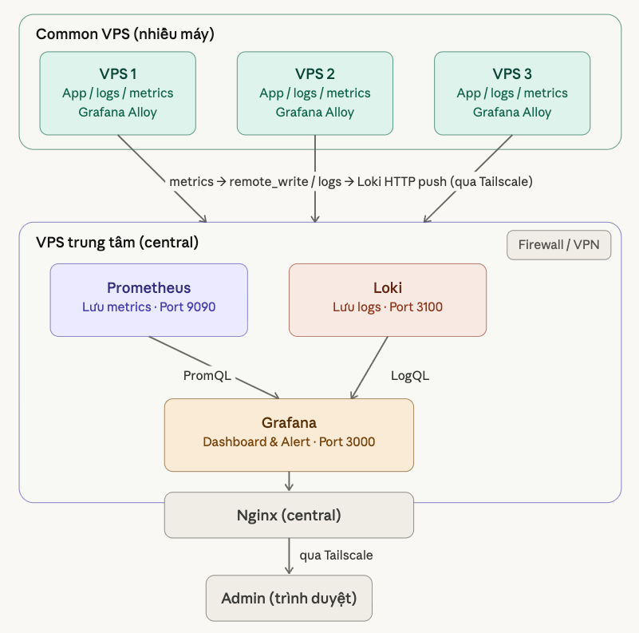
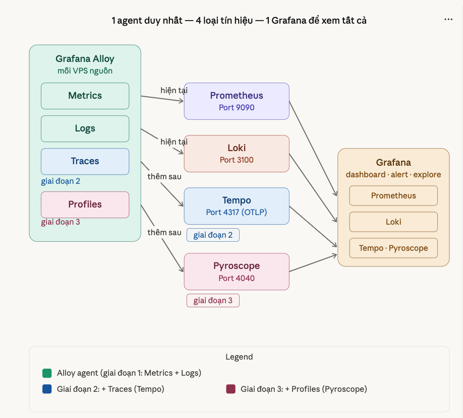
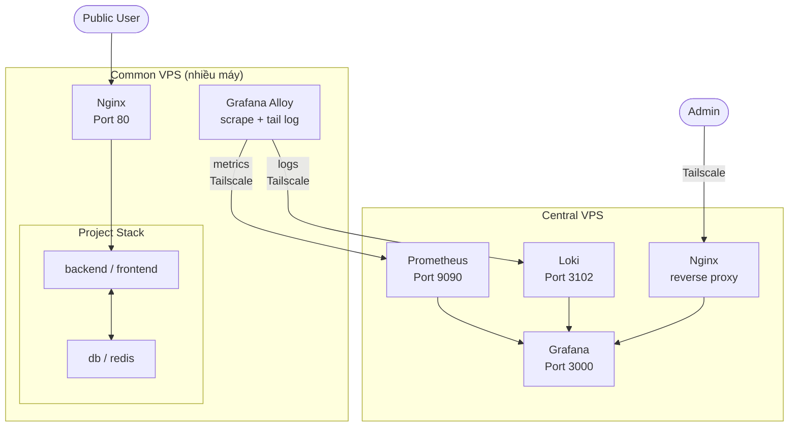
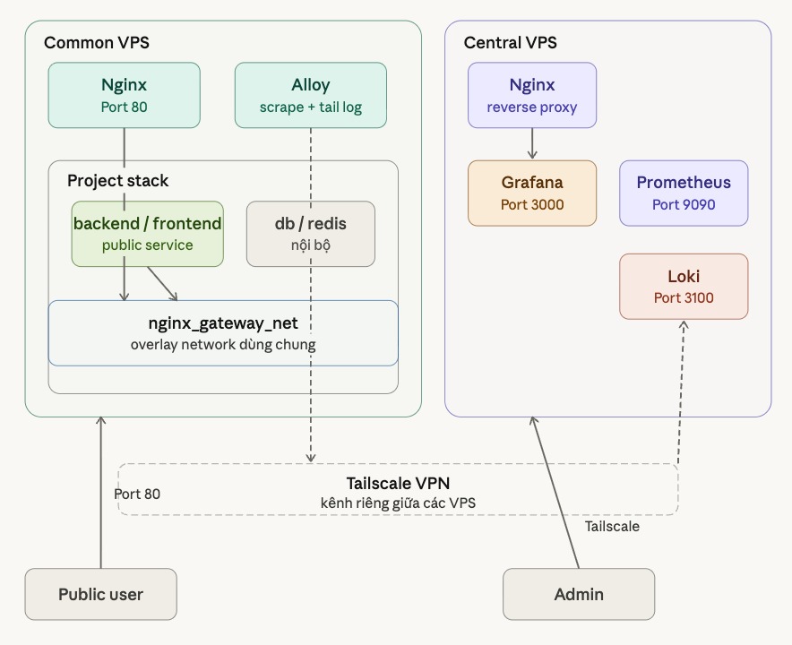
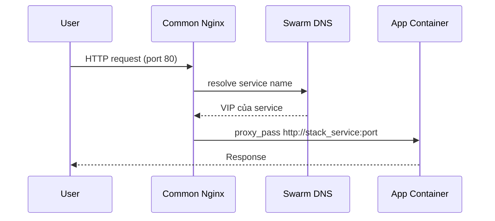
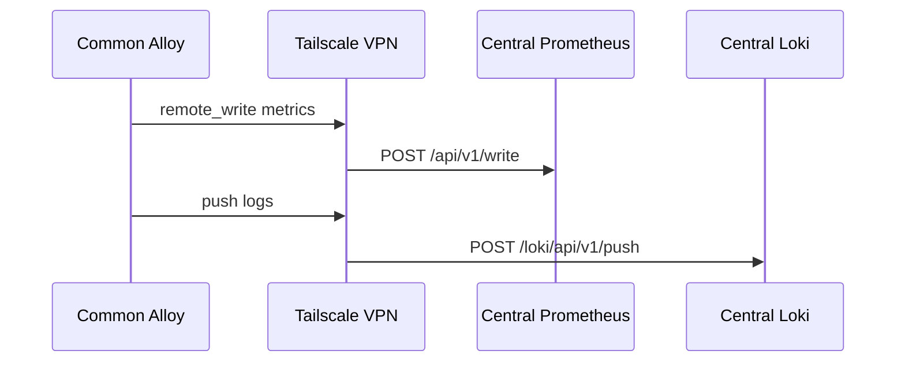
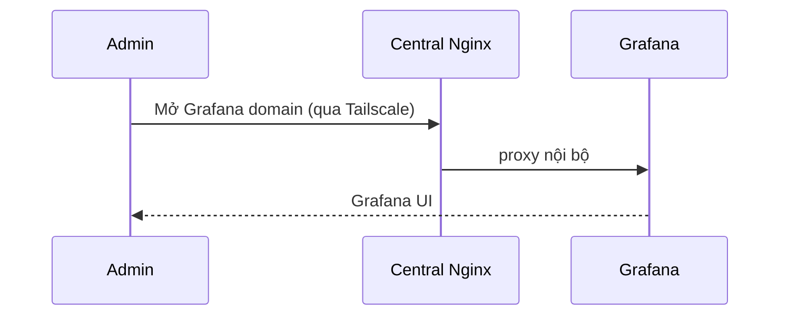
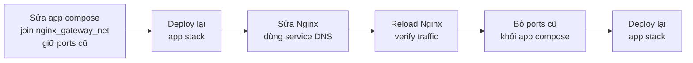

# Centralized VPS Topology & Traffic Flow

> Tài liệu này giải thích kiến trúc và luồng vận hành của hệ thống monitoring tập trung.

## 1. Kiến trúc monitoring
---




## 2. Kiến Trúc project + monitoring

Hệ thống chia làm 2 nhóm VPS:

| Nhóm | Vai trò |
|---|---|
| **Common VPS** (nhiều máy) | Chạy app, thu thập logs/metrics, reverse proxy |
| **Central VPS** (1 máy) | Lưu trữ metrics/logs, cung cấp Grafana UI |



---

## 2.1 Thành Phần Chính

### 2.1.1. Common VPS — stack `monitoring_common`

```
monitoring_common/
├── nginx          ← public entrypoint cho app
└── alloy          ← thu thập logs + metrics
```

**Nginx** join 2 networks:
- `monitoring_swarm_common` — internal stack network
- `nginx_gateway_net` — shared ingress network với app

**Alloy** — không public UI, chỉ đẩy data về Central qua Tailscale.

---

### 2.1.2. Central VPS — stack `monitoring_central`

```
monitoring_central/
├── nginx          ← public entrypoint cho Grafana
├── grafana        ← dashboard & alert
├── prometheus     ← nhận remote_write từ Alloy
└── loki           ← nhận push logs từ Alloy
```

Grafana **không** publish port `3000` ra ngoài — đi qua Nginx.

---
## 3. Kiến trúc network


## 3.1. Tại Sao Không Dùng `172.17.0.1`

Cách cũ dùng `proxy_pass http://172.17.0.1:<port>` có nhiều vấn đề:

| Vấn đề | Chi tiết |
|---|---|
| Phụ thuộc host port | App phải publish port ra host mới dùng được |
| Rủi ro security | Port host có thể bị truy cập trực tiếp từ Internet |
| Khó scale | Nhiều stack trên 1 VPS dễ conflict port |
| Khó đọc | Không rõ port đó thuộc service nào |

**Cách mới** dùng Swarm service DNS:

```nginx
# Cũ ❌
proxy_pass http://172.17.0.1:3001;

# Mới ✅
proxy_pass http://<STACK_NAME>_<SERVICE_NAME>:<CONTAINER_PORT>;
```

Ví dụ:

```text
http://qr_code_production_backend:3000
```
```

---

## 3.2. Shared Ingress Network — `nginx_gateway_net`

**Join network này:**
- Common Nginx
- Mọi service app cần được reverse proxy

**Không join:**
- Database, Redis, Worker, service internal

> ⚠️ Chỉ đặt cùng tên trong YAML **chưa đủ**. Phải khai báo `external: true`:

```yaml
networks:
  nginx_gateway_net:
    external: true
    name: nginx_gateway_net
```

Và tạo network trước khi deploy:

```bash
make gateway_network
```

## 4. Các luồng Chính

### 4.1. Luồng 1 — Public User → App



> **Điểm quan trọng:** App không publish port ra host. Nginx route theo service DNS của Swarm.
>
> Ví dụ upstream: `http://qr_code_production_backend:3000`

---

### 4.2. Luồng 2 — Alloy → Prometheus / Loki



> **Điểm quan trọng:** Alloy gọi thẳng Central qua IP Tailscale — không đi qua Nginx.
> URL cấu hình trong `.env`:
> ```
> CENTRAL_PROM_URL=http://<CENTRAL_TAILSCALE_IP>:9090/api/v1/write
> CENTRAL_LOKI_URL=http://<CENTRAL_TAILSCALE_IP>:3102/loki/api/v1/push
> ```

#### 4.2.1. Policy Tailscale đề xuất

Để Tailscale không trở thành mạng phẳng, nên chốt policy theo hướng:

- `common` chỉ được tới `central:9090`
- `common` chỉ được tới `central:3102`
- `common` không được nói chuyện với `common` khác
- `central` không có quyền chủ động đi ngược vào `common`

Nói ngắn gọn: đây là policy **1 chiều** cho monitoring:

```text
common  ->  central:9090
common  ->  central:3102
```

Mẫu policy:

```json
{
  "tagOwners": {
    "tag:central": ["autogroup:admin"],
    "tag:common": ["autogroup:admin"]
  },
  "acls": [
    {
      "action": "accept",
      "src": ["tag:common"],
      "dst": ["tag:central:9090", "tag:central:3102"]
    }
  ],
  "tests": [
    {
      "src": "tag:common",
      "accept": ["tag:central:9090", "tag:central:3102"],
      "deny": ["tag:central:22", "tag:central:12345", "tag:common:22", "tag:common:12345"]
    },
    {
      "src": "tag:central",
      "deny": ["tag:common:9090", "tag:common:3102", "tag:common:22", "tag:common:12345"]
    }
  ]
}
```

Ý nghĩa:

- `tagOwners`: chỉ admin mới được gắn tag `central` và `common`
- `acls`: `common` chỉ được connect tới `central:9090` và `central:3102`
- `tests`: kiểm tra rằng rule đang đúng như ý định, không bị mở rộng ngoài mong muốn

---

### 4.3. Luồng 3 — Admin → Grafana



> **Điểm quan trọng:** Admin phải kết nối Tailscale trước. Grafana không public Internet.

---

## 5. Hướng Dẫn dùng Case

### Case 1 — Dựng Central VPS lần đầu

```bash
cp .env.example .env
# Sửa Grafana credentials và endpoints

cp central/nginx/nginx_sites_available.example central/nginx/nginx_sites_available
# Sửa domain/subdomain Grafana

make swarm
make gateway_network
make deploy_central
```

---

### Case 2 — Dựng Common VPS lần đầu

```bash
cp .env.example .env
# Set VPS_NAME, CENTRAL_PROM_URL, CENTRAL_LOKI_URL

cp common/nginx/nginx_sites_available.example common/nginx/nginx_sites_available
# Sửa vhost của app theo service DNS

make swarm
make gateway_network
make deploy_common
```

Lưu ý thêm với Tailscale:

- Central VPS nên được gắn `tag:central`
- các Common VPS nên được gắn `tag:common`
- sau khi gắn tag, nên test:
  - Common -> Central:`9090`, `3102` là **được**
  - Common -> Common là **không được**
  - Central -> Common là **không được** nếu chỉ dùng Tailscale cho monitoring 1 chiều

---

### Case 3 — Onboard project app mới

Project mới cần đảm bảo:

- [ ] Stack name rõ ràng
- [ ] Service public join `nginx_gateway_net`
- [ ] Service public **không** publish port host
- [ ] Database/Redis ở private network riêng

Sau đó:

```bash
# 1. Thêm server block vào Common Nginx
# 2. Set $project đúng tên stack
# 3. Route tới http://<stack>_<service>:<port>
# 4. Reload Nginx
docker exec $(docker ps -q --filter name=nginx) nginx -s reload

# 5. Tạo dashboard nếu cần
make dashboards_project PROJECT=<TEN_STACK>
```

---

### Case 3A — Migrate project cũ từ host port → `nginx_gateway_net`

Áp dụng khi app đang dùng `ports` ra host và Nginx đang route qua `172.17.0.1`.



> ⚠️ `docker service update --force` **không** thêm network mới.
> Phải `docker stack deploy` lại để Swarm đọc thay đổi network/mount/ports.

---

### Case 4 — Update Nginx hoặc Alloy

```bash
# Common VPS
make deploy_common_nginx
make deploy_common_alloy

# Central VPS
make deploy_central_nginx
make deploy_central_grafana
```

Nếu thay đổi ở mức network/port/volume/env:

```bash
make deploy_common   # thay toàn bộ common stack
make deploy_central  # thay toàn bộ central stack
```

**Quy tắc nhớ nhanh:**

| Loại thay đổi | Lệnh |
|---|---|
| Đổi file config bên trong service | `make deploy_*` |
| Đổi network, port, volume, env, replicas | `make stack_*` |

---

### Case 5 — Update dashboard templates

```bash
make dashboards_project PROJECT=<TEN_STACK>
make dashboards_sync_all
make deploy_central_grafana
```

---

## 6. Lệnh Hay Dùng

```bash
# Network
make gateway_network

# Deploy toàn bộ stack
make deploy_common
make deploy_central

# Deploy từng service
make deploy_common_nginx
make deploy_common_alloy
make deploy_central_nginx
make deploy_central_grafana

# Dashboard
make dashboards_project PROJECT=my_stack
make dashboards_sync_all
```

---

## 7. Security

### 7.1. Common VPS

| Port | Trạng thái |
|---|---|
| `80` | Public — app ingress |
| App ports | Không public |
| Alloy UI | Không public mặc định |

### 7.2. Central VPS

| Port | Trạng thái |
|---|---|
| `80` | Public — Grafana qua Nginx |
| `9090` | Restricted — chặn ở firewall provider |
| `3102` | Restricted — chặn ở firewall provider |

> Repo này không dựa vào `ufw` để bảo vệ Docker published ports.
> Với Prometheus/Loki, chặn public ở firewall tầng provider (DigitalOcean, AWS, etc.).

---

## File Quan Trọng

```
.
├── docker-compose.common.yml
├── docker-compose.central.yml
├── .env.example
├── common/nginx/nginx_sites_available.example
└── central/nginx/nginx_sites_available.example
```

---

## Ghi Chú Vận Hành

- `VPS_NAME` phải **khác nhau** giữa các Common VPS
- `CENTRAL_PROM_URL` và `CENTRAL_LOKI_URL` phải là URL đầy đủ có path
- Mỗi vhost Nginx nên set đúng `$project` để metrics/logs có label chính xác
- TLS/cert xử lý ở Nginx layer nếu cần
