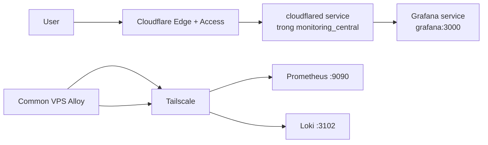

# Cloudflare Tunnel Cho Grafana Trên Central VPS

Tài liệu này hướng dẫn cách đưa Grafana lên Internet bằng Cloudflare Tunnel theo đúng mô hình hiện tại của repo:

- `Central VPS` chạy Docker Swarm
- `Grafana` nằm trong stack `monitoring_central`
- `Prometheus :9090` và `Loki :3102` vẫn dùng cho traffic nội bộ qua Tailscale
- chỉ `Grafana` đi qua Cloudflare Tunnel

Tài liệu này ưu tiên:

- đúng với Docker Swarm
- giảm tối đa port public trên host
- giảm tối đa secret nằm trong repo hoặc `.env`
- dễ vận hành và quay lui khi có sự cố

## 1. Kiến trúc chốt



Chốt luồng như sau:

- người dùng vào `https://grafana.tenmien.com`
- Cloudflare Access xác thực người dùng
- Cloudflare Tunnel route vào `grafana:3000`
- `Prometheus` và `Loki` không đi qua Tunnel
- `Alloy` trên Common VPS vẫn đẩy về Central qua IP Tailscale

## 2. Vì sao chọn cách này

Đây là cách phù hợp nhất với repo này vì:

- `Grafana` không cần publish `3000` ra host
- không cần giữ `nginx` trên Central chỉ để public Grafana
- không cần cài `cloudflared` bằng `apt` + `systemd` trên host
- không cần dùng `cert.pem` account-wide của locally-managed tunnel
- token có thể đưa vào Docker Swarm secret thay vì `.env`

Theo docs chính thức của Cloudflare:

- Tunnel là kết nối `outbound-only`
- tunnel remote-managed chỉ cần `token` để chạy
- `cloudflared` có thể chạy bằng Docker image

Theo docs chính thức của Docker:

- Swarm published ports đi qua `routing mesh`
- vì vậy cách bind `127.0.0.1:3000:3000` không phải hướng mình nên dựa vào cho kiểu triển khai này

## 3. Nguyên tắc bảo mật cần giữ

1. Không publish `grafana:3000` ra host.
2. Không để tunnel token trong repo.
3. Không để tunnel token trong `.env` nếu có thể tránh được.
4. Ưu tiên Docker secret cho token.
5. Bật Cloudflare Access cho `grafana.tenmien.com`.
6. `9090` và `3102` không public Internet.
7. Common VPS chỉ nối về Central qua IP Tailscale.

## 4. Điều kiện trước khi bắt đầu

Bạn cần có:

- domain đã quản lý bởi Cloudflare
- Central VPS đã cài Docker Engine và Swarm
- stack `monitoring_central` đang chạy được
- Grafana đang chạy nội bộ trong stack
- quyết định được hostname public, ví dụ `grafana.tenmien.com`

## 5. Chuẩn bị Grafana cho domain public

Grafana docs khuyến nghị `root_url` phải đúng với URL mà trình duyệt truy cập, và `enforce_domain` có thể dùng để tránh DNS rebinding.

Với repo này, thêm vào file `.env` trên Central VPS:

```env
GF_SERVER_DOMAIN=grafana.tenmien.com
GF_SERVER_ROOT_URL=https://grafana.tenmien.com
GF_SERVER_ENFORCE_DOMAIN=true
```

Không cần thêm `GF_SERVER_SERVE_FROM_SUB_PATH` vì ta đang publish trên subdomain riêng, không phải subpath.

Lưu ý:

- giữ `grafana` không có `ports:`
- `grafana` chỉ cần ở cùng network `monitoring_swarm_central`

## 6. Tạo tunnel trên Cloudflare Dashboard

Tại Dashboard:

1. Vào `Zero Trust` hoặc `Networking > Tunnels`.
2. Chọn `Create a tunnel`.
3. Chọn connector type là `Cloudflared`.
4. Đặt tên, ví dụ `monitoring-central`.
5. Ở bước environment, chọn `Docker`.
6. Copy lại lệnh install, nhưng chỉ lấy phần token `eyJ...`.

Không cần chạy lệnh Docker mà Cloudflare đưa ra nguyên si trong repo này. Ta sẽ đưa token vào Swarm secret.

## 7. Tạo public hostname

Trong tunnel vừa tạo:

1. Vào phần `Routes`.
2. Chọn `Add route`.
3. Chọn `Published application`.
4. Đặt hostname:
   - Hostname: `grafana.tenmien.com`
5. Đặt service URL:

```text
http://grafana:3000
```

Đây là tên service Docker Swarm trên cùng overlay network.

Không dùng:

- `http://127.0.0.1:3000`
- `http://public-ip:3000`
- `http://<tailscale-ip>:3000`

vì trong mô hình này `cloudflared` sẽ chạy cùng network với `grafana`, nên nó nối theo service DNS nội bộ là gọn nhất.

## 8. Bật Cloudflare Access cho Grafana

Nếu bạn bỏ qua bước này, domain Grafana sẽ public cho cả Internet.

Tại Cloudflare Zero Trust:

1. Vào `Access > Applications`.
2. Chọn `Add an application`.
3. Chọn `Self-hosted`.
4. Đặt tên ứng dụng, ví dụ `Grafana Production`.
5. Thêm public hostname:
   - `grafana.tenmien.com`
6. Tạo policy `Allow` cho đúng đối tượng được phép:
   - email cụ thể
   - domain email công ty
   - nhóm IdP

Cho production, nên bật Access ngay từ đầu.

## 9. Lưu token đúng cách

Cloudflare docs ghi rõ: ai có tunnel token đều có thể chạy tunnel đó.

Vì vậy:

- không commit token vào git
- không để token trong `.env.example`
- không paste token vào docs nội bộ rồi commit lên repo

Với Swarm, dùng Docker secret là hợp lý hơn env var.

Tạo secret trên Central manager:

```bash
printf '%s' 'PASTE_TUNNEL_TOKEN_HERE' | docker secret create cf_tunnel_token -
```

Kiểm tra:

```bash
docker secret ls
docker secret inspect cf_tunnel_token
```

Nếu cần rotate về sau, nên dùng tên có version để dễ rollback, ví dụ:

```bash
printf '%s' 'NEW_TOKEN' | docker secret create cf_tunnel_token_v2 -
```

## 10. Sửa compose cho Central

Trong `docker-compose.central.yml`, thêm service `cloudflared` và top-level `secrets`.

Mẫu để áp dụng:

```yaml
services:
  cloudflared:
    image: cloudflare/cloudflared:2025.4.0
    command: tunnel --no-autoupdate run --token-file /run/secrets/cf_tunnel_token
    secrets:
      - source: cf_tunnel_token
        target: cf_tunnel_token
        mode: 0400
    networks:
      - monitoring_swarm_central
    deploy:
      <<: *deploy_config
      replicas: 1

secrets:
  cf_tunnel_token:
    external: true
```

Khuyến nghị:

- không dùng `latest` cho production
- repo hiện đang pin `cloudflare/cloudflared:2025.4.0`
- giữ `replicas: 1` nếu hiện tại chỉ có 1 Central host

Tại sao dùng `--token-file`:

- `cloudflared` hỗ trợ `--token-file` cho remote-managed tunnel
- token sẽ được đọc từ file secret trong `/run/secrets/...`
- sạch hơn và kín hơn so với env var

## 11. Quyền và phạm vi truy cập

Đây là mô hình quyền bạn nên đặt mục tiêu:

| Đối tượng | Nên thấy gì |
|---|---|
| Host OS | không có token trong shell history nếu làm đúng |
| Git repo | không có token |
| `.env` | không có token |
| Grafana service | không cần biết token |
| cloudflared service | chỉ thấy file token được mount |
| Internet công cộng | chỉ thấy `grafana.tenmien.com`, không thấy `:3000` |

Theo Docker docs:

- secret chỉ được mount vào service được cấp quyền
- secret mặc định nằm ở `/run/secrets/<secret_name>`
- secret được quản lý trong Swarm, chỉ cấp cho task đang chạy

## 12. Deploy

Sau khi đã:

- tạo tunnel
- tạo hostname
- bật Access
- tạo Docker secret
- sửa compose

thì deploy:

```bash
make deploy_central
```

Kiểm tra:

```bash
docker stack services monitoring_central
docker service ps monitoring_central_cloudflared
docker service logs -f monitoring_central_cloudflared
docker service logs -f monitoring_central_grafana
```

## 13. Verify từng lớp

### 13.1. Verify Grafana nội bộ

Kiểm tra task Grafana:

```bash
docker ps --filter label=com.docker.swarm.service.name=monitoring_central_grafana
```

Kiểm tra health API từ trong container:

```bash
docker exec -it $(docker ps --filter label=com.docker.swarm.service.name=monitoring_central_grafana -q | head -n1) \
  wget -qO- http://127.0.0.1:3000/api/health
```

Kỳ vọng có JSON trả về và `database: ok`.

### 13.2. Verify cloudflared

```bash
docker service logs -f monitoring_central_cloudflared
```

Kỳ vọng:

- có log đã connect lên Cloudflare
- service ở trạng thái `Running`

### 13.3. Verify public domain

Từ máy của bạn:

```bash
curl -I https://grafana.tenmien.com/login
```

Kỳ vọng:

- nếu Access bật, bạn sẽ thấy flow Access trước
- sau khi qua Access, vào được Grafana

## 14. Firewall và network

Theo Cloudflare docs:

- `cloudflared` kết nối outbound tới Cloudflare trên port `7844`
- firewall cần cho phép egress cần thiết
- với mô hình an toàn, nên block ingress không cần thiết

Với Central VPS này, mình khuyên:

- `Grafana :3000`: không public
- `Prometheus :9090`: không public Internet
- `Loki :3102`: không public Internet
- chỉ cho `9090` và `3102` đi từ Common VPS qua Tailscale

Nói cách khác:

- Tunnel giải quyết public access cho Grafana
- Tailscale giải quyết private ingest cho monitoring

## 15. Vận hành production

### 15.1. Pin version

Cho production:

- pin `cloudflare/cloudflared:2025.4.0` hoặc version mới hơn mà bạn đã test
- cập nhật có chủ đích
- không nên để `latest`

### 15.2. Rotate token

Cloudflare khuyến nghị rotate token định kỳ.

Nếu chỉ có 1 replica:

- rotate trong maintenance window
- tạo secret mới
- sửa compose nếu đổi tên secret
- redeploy stack

Nếu có từ 2 replica trở lên, Cloudflare docs cho biết có thể rotate với ít gián đoạn hơn.

### 15.3. Monitoring

Nên theo dõi:

- `docker service logs -f monitoring_central_cloudflared`
- trạng thái tunnel trong dashboard Cloudflare
- logs Grafana

### 15.4. Blast radius

Khuyến nghị thêm:

- tách tunnel `production` và `staging`
- không dùng chung tunnel cho quá nhiều ứng dụng nếu không cần

## 16. Những gì không nên làm

1. Không publish `3000:3000` ra host rồi mới dùng Tunnel.
2. Không dùng `127.0.0.1:3000:3000` để “an toàn” trong Swarm rồi tin hoàn toàn vào đó.
3. Không để tunnel token trong `.env`.
4. Không commit token vào repo.
5. Không bỏ Access nếu Grafana có dữ liệu nhạy cảm.
6. Không đưa `9090` và `3102` lên Tunnel nếu mục tiêu của bạn chỉ là public Grafana.

## 17. Checklist chốt

- [ ] Central stack không còn `nginx`
- [ ] Grafana không có `ports:`
- [ ] `GF_SERVER_DOMAIN` đúng với domain thật
- [ ] `GF_SERVER_ROOT_URL` đúng với URL public
- [ ] `GF_SERVER_ENFORCE_DOMAIN=true`
- [ ] Tunnel là remote-managed
- [ ] Public hostname là `grafana.tenmien.com`
- [ ] Service URL là `http://grafana:3000`
- [ ] Đã bật Cloudflare Access
- [ ] Tunnel token được lưu bằng Docker secret
- [ ] `cloudflared` đọc token bằng `--token-file`
- [ ] `9090` và `3102` không public Internet

## 18. Nguồn tham khảo chính thức

- Cloudflare Tunnel setup:
  - https://developers.cloudflare.com/tunnel/setup/
- Cloudflare Tunnel configuration và replicas:
  - https://developers.cloudflare.com/tunnel/configuration/
- Cloudflare tunnel token và rotation:
  - https://developers.cloudflare.com/tunnel/advanced/tunnel-tokens/
  - https://developers.cloudflare.com/cloudflare-one/networks/connectors/cloudflare-tunnel/configure-tunnels/remote-tunnel-permissions/
- Cloudflare `cloudflared` run parameters:
  - https://developers.cloudflare.com/cloudflare-one/networks/connectors/cloudflare-tunnel/configure-tunnels/run-parameters/
- Cloudflare Access cho self-hosted app:
  - https://developers.cloudflare.com/cloudflare-one/applications/configure-apps/self-hosted-apps/
- Docker Swarm ingress / routing mesh:
  - https://docs.docker.com/engine/swarm/ingress/
- Docker Swarm secrets:
  - https://docs.docker.com/engine/swarm/secrets/
- Grafana configuration:
  - https://grafana.com/docs/grafana/latest/setup-grafana/configure-grafana/
