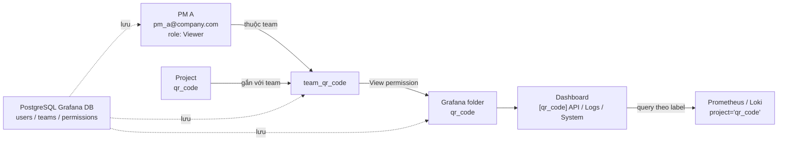

# Phân Quyền PM Theo Project Trong Grafana

Tài liệu này áp dụng cho case PM nội bộ công ty:

- PM chỉ xem dashboard của một vài project được phân quyền.
- Dùng Grafana local users.
- Dùng team theo project.
- Dùng folder permission.
- PM giữ role `Viewer`; Admin vẫn dùng được Explore.

Không triển khai cách ly dữ liệu tuyệt đối bằng LBAC hoặc tách tenant trong bước này.

User/team/folder permission được lưu trong PostgreSQL của Grafana (`grafana_postgres_data`). Dashboard JSON vẫn nằm trong repo, còn metrics/logs nằm ở Prometheus/Loki.

## 1. Mô Hình Quyền

Mỗi PM được tạo thành một user trong Grafana. User không được gán trực tiếp vào từng dashboard, mà được add vào team theo project. Mỗi project có một folder dashboard riêng và folder đó chỉ cấp quyền `View` cho team tương ứng.

Vì vậy PM thuộc team nào thì chỉ thấy project của team đó.

Ví dụ với project `qr_code`:



Nói ngắn gọn:

```text
PM A -> team_qr_code -> folder qr_code -> dashboard qr_code -> data project="qr_code"
```

PostgreSQL chỉ lưu phần quyền của Grafana. Prometheus/Loki vẫn lưu dữ liệu monitoring và phân biệt project bằng label `project`.

Dashboard project đang nằm theo folder:

```text
central/dashboards/projects/<project>/
```

Grafana đang provision dashboard với:

```yaml
foldersFromFilesStructure: true
```

Vì vậy mỗi thư mục project sẽ thành một folder trong Grafana, ví dụ:

```text
central/dashboards/projects/qr_code/ -> folder qr_code
central/dashboards/projects/cross/   -> folder cross
```

Quyền sẽ đặt theo folder:

```text
folder qr_code -> team_qr_code: View
folder cross   -> team_cross: View
folder crm     -> team_crm: View
```

PM thuộc team nào thì xem được folder project đó.

## 2. Explore

Không cần tắt Explore toàn Grafana.

Theo quyền mặc định của Grafana OSS:

```text
Admin  -> có Explore
Editor -> có Explore
Viewer -> không có Explore
```

Vì PM được tạo với role `Viewer`, PM không thấy menu Explore và không truy cập được `/explore` trực tiếp. Admin vẫn dùng Explore để debug Prometheus/Loki bình thường.

Không cấu hình biến này:

```env
GF_EXPLORE_ENABLED=false
```

Vì nó tắt Explore toàn hệ thống, kể cả admin.

Không bật biến này:

```env
GF_USERS_VIEWERS_CAN_EDIT=true
```

Vì khi bật, Viewer có thể dùng Explore và edit tạm panel.

## 3. Tạo User PM

Trong Grafana:

```text
Administration -> Users and access -> Users
```

Tạo user PM, ví dụ:

```text
pm_a@company.com
pm_b@company.com
```

Role của PM:

```text
Viewer
```

Không cấp PM role `Editor` hoặc `Admin`.

## 4. Tạo Team Theo Project

Trong Grafana:

```text
Administration -> Users and access -> Teams
```

Tạo team theo project:

```text
team_qr_code
team_cross
team_crm
```

Add PM vào team tương ứng:

```text
PM A -> team_qr_code, team_cross
PM B -> team_crm
PM C -> team_qr_code
```

Nên tạo team theo project thay vì theo PM, vì sau này thêm/bớt PM dễ hơn.

## 5. Gán Folder Permission

> ⚠️ **Bước dễ quên nhất — và nếu sót thì toàn bộ phân quyền vô nghĩa.**
> Mặc định mỗi folder Grafana có sẵn permission `Viewer -> View` (org role Viewer). Nếu không xoá, **mọi PM thấy mọi folder**, team-based permission không còn tác dụng.

Vào folder dashboard của từng project:

```text
Dashboards -> folder qr_code -> Permissions
```

**Bước 1 — gỡ quyền mặc định rộng:**

```text
Viewer -> View   (XOÁ)
Editor -> Edit   (XOÁ nếu có)
```

**Bước 2 — add team:**

```text
team_qr_code -> View
```

Tương tự cho các folder khác:

```text
folder cross -> team_cross: View
folder crm   -> team_crm: View
```

Sau khi xong, folder chỉ còn 2 permission: `Admin -> Admin` (mặc định) và `team_<project> -> View`.

## 6. Khi Có Project Mới

Ví dụ thêm project `billing`.

Tạo dashboard:

```bash
make dashboards_project PROJECT=billing VPS=vps-billing-01
make deploy_central_grafana
```

Trong Grafana:

1. Tạo team `team_billing`.
2. Add PM phụ trách billing vào team.
3. Vào folder `billing`.
4. Gỡ quyền rộng nếu có.
5. Add permission:

```text
team_billing -> View
```

## 7. Kiểm Tra

Login bằng admin:

- Thấy tất cả project folder.
- Tạo/sửa được users, teams, folder permissions.
- Vào được Explore để debug.

Login bằng PM A:

- Chỉ thấy folder được cấp.
- Không thấy folder project khác.
- Không thấy menu Explore.

Login bằng PM B:

- Chỉ thấy project của PM B.
- Không thấy folder của PM A nếu không chung team.

Kiểm tra sau deploy Central:

- Grafana vẫn load dashboard.
- Cloudflare Tunnel vẫn vào được Grafana.
- Admin thấy Explore.
- PM Viewer không thấy Explore.

## 8. Giới Hạn Của Cách Này

Cách này phù hợp cho PM nội bộ vì mục tiêu chính là:

```text
PM chỉ xem dashboard project được giao
```

Nó không phải cách ly dữ liệu tuyệt đối ở tầng datasource.

Dữ liệu các project vẫn nằm chung trong Prometheus/Loki và phân biệt bằng label:

```text
project="qr_code"
project="cross"
```

PM vẫn xem được PromQL/LogQL của panel qua `Panel menu -> Inspect -> Query`. Nếu PM tinh ý, họ có thể đọc được tên label `project` của project khác. Đây là vấn đề UI visibility, không phải data isolation.

Nếu sau này cần cách ly dữ liệu chặt hơn cho khách hàng ngoài công ty, cần xem thêm một trong các hướng:

- Grafana Enterprise/Cloud LBAC theo label `project`.
- Tách datasource theo project.
- Tách tenant Loki/Prometheus/Mimir.
- Tách Grafana organization hoặc instance.
