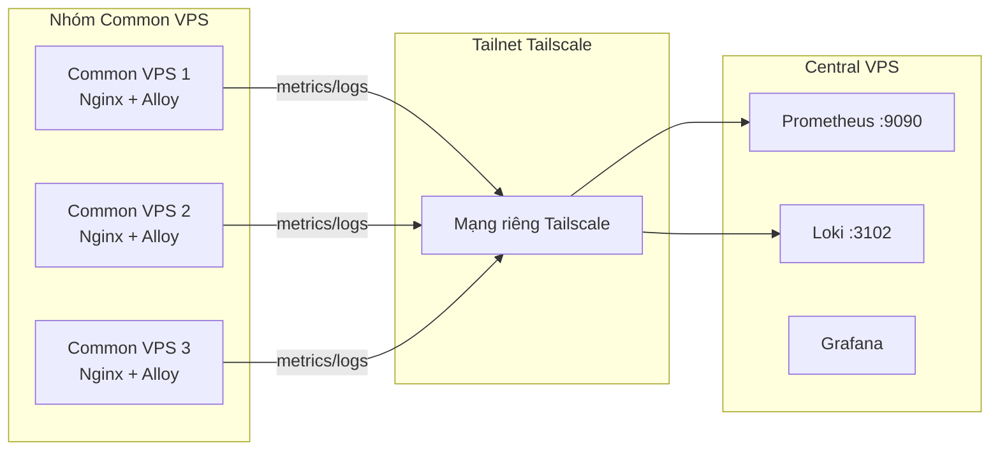

# Kiến Trúc Tailscale Cho Common VPS -> Central VPS

Tài liệu này viết gọn cho đúng mô hình bạn đang dùng:

- nhiều **Common VPS**
- một **Central VPS**
- mỗi Common VPS gửi logs/metrics về Central qua **Tailscale**
- không bàn sâu chuyện admin SSH vì đó không phải nhu cầu chính ở đây

## 1. Mô hình bạn đang làm là gì

Bạn tạo một **tailnet Tailscale**, rồi cho:

- Central VPS join vào
- các Common VPS join vào

Sau đó:

- mỗi máy có một IP Tailscale riêng
- Common VPS dùng IP Tailscale của Central để gửi data

Trong repo này, chỗ đó nằm ở:

- [`.env.example`](/Users/ducpt/WorkSpace/nginx_cadvisor_prometheus_grafana/.env.example)
  - `CENTRAL_PROM_URL=http://CENTRAL_TAILSCALE_IP:9090/api/v1/write`
  - `CENTRAL_LOKI_URL=http://CENTRAL_TAILSCALE_IP:3102/loki/api/v1/push`
- [`common/alloy/config.alloy`](/Users/ducpt/WorkSpace/nginx_cadvisor_prometheus_grafana/common/alloy/config.alloy)
  - Alloy đọc 2 biến env này để đẩy metrics/logs về Central

Hiểu đơn giản:

```text
Common VPS -> Tailscale -> Central VPS
```

## 2. Sơ đồ kiến trúc nên dùng



Ý nghĩa:

- Common VPS không cần nói chuyện với nhau
- Common VPS chỉ cần nói chuyện với Central
- Central là điểm thu thập tập trung

## 3. Cái gì là an toàn, cái gì là rủi ro

### Điều an toàn

- Dữ liệu đi qua Tailscale được mã hóa
- Bạn không cần mở public port giữa các VPS để chúng nói chuyện với nhau
- Common VPS có thể dùng private path để gửi về Central

### Điều rủi ro

Rủi ro không nằm ở việc "cùng một tailnet", mà nằm ở việc:

- bạn có để tailnet thành mạng phẳng không
- một Common VPS có được nói chuyện lung tung tới máy khác không

Nếu một Common VPS bị hack:

- attacker có thể dùng đúng quyền mà node đó đang có
- nếu node đó chỉ được gửi tới Central ở vài port cố định thì phạm vi hại sẽ nhỏ
- nếu node đó được nói chuyện tới mọi node, mọi port thì rủi ro sẽ lớn

## 4. Chốt kiến trúc an toàn cho case này

Bạn nên chốt như sau:

### Cho phép

- Common VPS -> Central VPS:`9090`
- Common VPS -> Central VPS:`3102`

### Không cần cho phép

- Common VPS -> Common VPS
- Common VPS -> mọi port khác trên Central

Nói ngắn gọn:

> Common chỉ được đẩy monitoring về Central, không được đi ngang sang máy khác.

## 5. Cách làm thực tế

### Bước 1: Tạo tailnet

Tạo một tailnet Tailscale cho hệ thống này.

Trong tailnet đó:

- Central VPS join vào
- từng Common VPS join vào

### Bước 2: Gắn vai trò rõ ràng

Nên dùng tags:

- `tag:central` cho Central VPS
- `tag:common` cho các Common VPS

Mục đích:

- dễ viết policy
- không biến mọi server thành một nhóm chung quá rộng

### Bước 3: Viết policy hẹp

Tư duy policy nên là:

- `tag:common` chỉ được tới `tag:central:9090,3102`
- không có rule cho `tag:common -> tag:common:*`

Đây là điểm quan trọng nhất.

Nếu không có policy rõ, tailnet rất dễ thành mạng phẳng.

### Bước 4: Đặt endpoint về Central

Trên từng Common VPS, trong file `.env`, dùng IP Tailscale của Central:

```env
CENTRAL_PROM_URL=http://<CENTRAL_TAILSCALE_IP>:9090/api/v1/write
CENTRAL_LOKI_URL=http://<CENTRAL_TAILSCALE_IP>:3102/loki/api/v1/push
```

Ví dụ:

```env
CENTRAL_PROM_URL=http://100.64.0.10:9090/api/v1/write
CENTRAL_LOKI_URL=http://100.64.0.10:3102/loki/api/v1/push
```

### Bước 5: Deploy Central trước

Trên Central VPS:

- chạy Prometheus
- chạy Loki
- kiểm tra port `9090` và `3102` đang lắng nghe

Repo hiện tại đã map:

- [`docker-compose.central.yml`](/Users/ducpt/WorkSpace/nginx_cadvisor_prometheus_grafana/docker-compose.central.yml)
  - `9090:9090`
  - `3102:3102`

### Bước 6: Deploy Common sau

Trên từng Common VPS:

- set `.env`
- deploy `monitoring_common`

Alloy sẽ đọc:

- `CENTRAL_PROM_URL`
- `CENTRAL_LOKI_URL`

rồi đẩy data về Central.

## 6. Checklist ngắn để an toàn

- [ ] Central VPS có Tailscale
- [ ] Mỗi Common VPS có Tailscale
- [ ] Có phân vai trò `tag:central` và `tag:common`
- [ ] Common chỉ được phép tới Central ở `9090`, `3102`
- [ ] Không cho Common nói chuyện với nhau
- [ ] `.env` trên Common trỏ tới IP Tailscale của Central

## 6.1 Mẫu policy Tailscale cho case này

Đây là mẫu policy ngắn, đúng với nhu cầu hiện tại:

- Common chỉ được gửi về Central ở `9090`, `3102`
- Common không được đi sang Common khác
- Common không được đi sang port khác trên Central

```json
{
  "tagOwners": {
    "tag:central": ["autogroup:admin"],
    "tag:common": ["autogroup:admin"]
  },
  "acls": [
    {
      "action": "accept",
      "src": ["tag:common"],
      "dst": ["tag:central:9090", "tag:central:3102"]
    }
  ],
  "tests": [
    {
      "src": "tag:common",
      "accept": ["tag:central:9090", "tag:central:3102"],
      "deny": ["tag:central:22", "tag:central:12345", "tag:common:22", "tag:common:12345"]
    }
  ]
}
```

Ý nghĩa:

- `tagOwners`
  - chỉ admin mới được gắn `tag:central` và `tag:common`

- `acls`
  - `tag:common` chỉ được connect tới:
    - `tag:central:9090`
    - `tag:central:3102`

- `tests`
  - kiểm tra rằng:
    - Common được vào đúng `9090`, `3102`
    - Common không được vào:
      - `central:22`
      - `central:12345`
      - `common:22`
      - `common:12345`

Hiểu ngắn gọn:

- đây là policy **1 chiều**
- Common chủ động gửi data về Central
- ngoài 2 port monitoring ra thì deny

## 7. Khi nào mô hình này ổn

Mô hình này rất hợp nếu mục tiêu là:

- gom monitoring về một nơi
- không muốn mở kết nối public giữa các VPS
- muốn triển khai đơn giản hơn full mesh VPN thủ công

## 8. Khi nào cần cẩn thận hơn

Bạn cần cẩn thận hơn nếu:

- dùng chung một tag rất rộng cho mọi server
- không viết policy
- để Common VPS nói chuyện được với nhau
- sau này thêm subnet router mà không kiểm soát kỹ

## 9. Kết luận

Với case của bạn, cách dùng Tailscale đúng là:

- **dùng nó như đường riêng để Common đẩy data về Central**
- **không dùng nó như một LAN nội bộ phẳng**

Chốt gọn:

- mô hình này **ổn**
- **an toàn hay không phụ thuộc chủ yếu vào policy**
- điều quan trọng nhất là:  
  **Common chỉ được tới Central ở đúng các port cần thiết**

## Tài liệu chính thức

- Control/data planes: https://tailscale.com/docs/concepts/control-data-planes
- Access control: https://tailscale.com/docs/features/access-control
- ACLs: https://tailscale.com/docs/features/access-control/acls
- Tags: https://tailscale.com/docs/features/tags
- Device visibility: https://tailscale.com/docs/concepts/device-visibility
